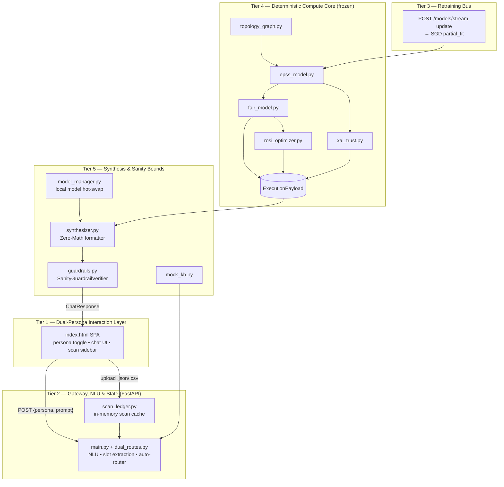
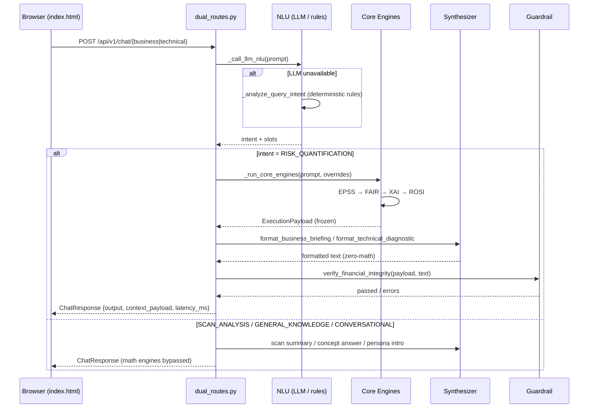
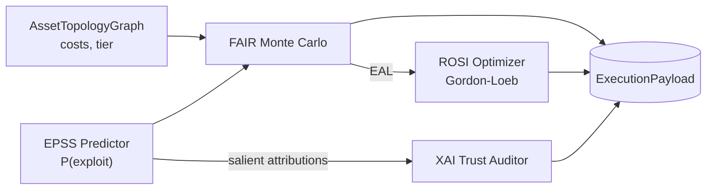

# CyberRiskIQ Copilot — Architecture

> **Hybrid AI + deterministic** Cyber Risk Quantification (CRQ) chatbot.
> Generative LLMs (Gemini / OpenAI / Anthropic) handle **natural-language understanding** and **prose formatting only**; every number is computed by pure-Python math engines and locked inside a frozen `ExecutionPayload` before any text is generated.

---

## 1. System Overview

CyberRiskIQ Copilot answers free-form questions about cyber risk for two user personas and returns mathematically grounded, reproducible metrics:

| Persona | Audience | Metrics returned |
|---|---|---|
| **Business / Executive** | CISO, Board, Risk Officer | EAL ₹ Cr, 95% VaR, ROSI %, Gordon-Loeb viability |
| **Technical / SOC** | SecOps, DevSecOps, IR | CVSS vector & score, EPSS probability, XAI trust %, salient tokens |

### Design Principles (enforced in code)
1. **Zero-Math Rule** — the LLM may only *format* pre-calculated numbers; it may never calculate, estimate, or alter any figure (`api_layer/synthesizer.py`).
2. **Frozen contracts** — all Developer A compute models use `model_config = ConfigDict(frozen=True, strict=True)`; no unvalidated dicts cross module boundaries (`schemas/data_models.py`).
3. **No silent fixups** — invariants (e.g. `VaR_0.95 > EAL`) raise `AssertionError` instead of being clamped (`core_engines/fair_model.py`).
4. **Graceful AI degradation** — NLU and synthesis fall back through multiple ladders down to fully deterministic templates, so the platform keeps working with zero LLM availability.

---

## 2. High-Level 5-Tier Architecture

```
┌──────────────────────────────────────────────────────────────────────────┐
│ TIER 1 — DUAL-PERSONA INTERACTION LAYER (Frontend)                       │
│   index.html (vanilla JS SPA) + style.css                                │
│   • Persona toggle  • chat bubbles  • score cards  • metric highlighting │
│   • Scan ingestion sidebar (upload .json/.csv)                           │
└───────────────────────────────┬──────────────────────────────────────────┘
                                │  HTTP POST {session_id, persona, prompt}
                                ▼
┌──────────────────────────────────────────────────────────────────────────┐
│ TIER 2 — GATEWAY, NLU & STATE (FastAPI)        api_layer/                │
│   main.py → dual_routes.py (router + NLU + intent handlers)              │
│   NLU: LLM (Gemini→OpenAI)  ⇢  deterministic _analyze_query_intent       │
│   Slot extraction: CVE regex, ₹ budget regex, asset matcher              │
│   Auto-route: SemanticIntentRouter (TF-IDF cosine)                       │
└──────────────┬───────────────────────────────┬───────────────────────────┘
               │ query-type routing            │ risk-quantification path
               ▼                               ▼
┌────────────────────────────────────┐   ┌─────────────────────────────────┐
│ TIER 3 — RETRAINING BUS            │   │ TIER 4 — DETERMINISTIC COMPUTE  │
│ POST /models/stream-update         │   │ CORE (core_engines/ — frozen)   │
│ telemetry → SGD partial_fit on     │   │ topology_graph → epss_model →   │
│ EPSSPredictor (live online learn)  │   │ fair_model → xai_trust →        │
└────────────────────────────────────┘   │ rosi_optimizer → ExecutionPayload│
                                         └───────────────┬─────────────────┘
                                                         ▼
┌──────────────────────────────────────────────────────────────────────────┐
│ TIER 5 — SYNTHESIS & SANITY BOUNDS        api_layer/                     │
│   synthesizer.py  (HybridSynthesizer — Zero-Math formatting)             │
│     local gen model → external LLM → deterministic templates             │
│   guardrails.py   (SanityGuardrailVerifier — hallucination blocker)      │
│   model_manager.py (hot-swap fallback)  •  scan_ledger.py (live KB)      │
└──────────────────────────────────────────────────────────────────────────┘
```

### Mermaid (renders on GitHub)



---

## 3. Component-Level Architecture (file mapping)

```
repository_root/
├── index.html ────────────── Frontend SPA (vanilla JS, inline CSS + style.css)
│
├── api_layer/ ────────────── FastAPI "Developer B" gateway layer (mutable)
│   ├── main.py              App factory, CORS, /health, router registration
│   ├── dual_routes.py       ★ Core router + NLU + orchestration (939 LOC)
│   ├── synthesizer.py       HybridSynthesizer: templates + LLM hooks
│   ├── guardrails.py        SanityGuardrailVerifier (financial integrity)
│   ├── model_manager.py     Local transformer hot-swap manager (singleton)
│   ├── scan_ledger.py       In-memory vulnerability scan cache (singleton)
│   └── mock_kb.py           Static fallback vuln/asset lookup
│
├── core_engines/ ─────────── Deterministic math core (Developer A, frozen)
│   ├── topology_graph.py    Mock Neo4j asset resolver (tiers, dependencies)
│   ├── epss_model.py        16-feature Elastic-Net logistic + SGD online learner
│   ├── fair_model.py        Open FAIR v3.0 lognormal Monte Carlo (10k trials)
│   ├── xai_trust.py         Mirtaheri-2025 trust auditor (WCS + adaptive IQR)
│   └── rosi_optimizer.py    Gordon-Loeb / ROSI economic optimizer
│
├── schemas/
│   └── data_models.py       Pydantic v2 contracts (frozen core + mutable API)
│
├── tests/
│   ├── test_engines.py              21 tests — math invariants
│   ├── test_api_layer.py             8 tests — API integration
│   └── test_chatbot_edge_cases.py   17 tests — stress / guardrails
│
├── data.json / vulnerability_scan_export.json   sample asset + scan data
└── docs: README, architecture.md, prd.md, phases.md, memory.md,
          rules.md, demo_validation_queries.md
```

**Engine singletons** are instantiated once at import time in `dual_routes.py`:
`EPSSPredictor`, `AssetTopologyGraph`, `FAIRRiskEngine`, `XAITrustAuditor`, `ROSIOptimizer`, `HybridSynthesizer`, `SanityGuardrailVerifier`, `scan_ledger`, `model_manager`.

---

## 4. End-to-End Request Flow (RISK_QUANTIFICATION path)

```
Browser (index.html)
   │  POST /api/v1/chat/{business|technical}
   │  {session_id, persona, prompt, context_overrides}
   ▼
[1] _call_llm_nlu(prompt)                 ← Gemini → OpenAI → None
   │  returns {intent, cve_id, asset_name, budget_lakhs}
   ▼
[2] intent branch:
   ├─ SCAN_ANALYSIS        → _handle_scan_analysis (summarize scan ledger)
   ├─ CONVERSATIONAL / GEN_KNOWLEDGE → generate_conversational_response (no engines)
   └─ RISK_QUANTIFICATION  → _run_core_engines(prompt, overrides)        ★
        │ _extract_slots  → {cve_id, asset_name, budget_lakhs}
        │ AssetTopologyGraph.resolve_asset(...)   (fallback: core_payment_switch)
        │ vuln lookup: scan_ledger.lookup_cve() → mock_kb.lookup_vuln()
        │ build ThreatContext (16 EPSS feature flags)
        ▼
[3] Deterministic pipeline (frozen ExecutionPayload):
        epss_predictor.predict_probability()   → EPSSPrediction
        fair_engine.run_monte_carlo()          → FAIRSimulationResult (EAL, VaR)
        xai_auditor.evaluate_trust_score()     → XAITrustResult (trust %, status)
        rosi_optimizer.evaluate_investment()   → ROSIOptimizationResult (ROSI, GL cap)
   ▼
[4] format_business_briefing / format_technical_diagnostic   (Zero-Math)
        model_manager.generate() → call_external_llm() → template_*()
   ▼
[5] guardrail.verify_financial_integrity(payload, text)
        → passed / errors (blocks hallucinated ₹ / % / GL contradictions)
   ▼
[6] _build_context_payload() → DeterministicContextPayload (+ guardrail flags)
   ▼
[7] ChatResponse { formatted_output, context_payload, latency_ms } → JS renders
        • formatted text + score cards (EAL/VaR/ROSI or EPSS/CVSS/XAI)
        • guardrail badge (✓ Passed / ✗ Flag)  • latency badge
```

### Mermaid sequence



---

## 5. NLU & Intent Routing Decision Tree

```
                        user prompt
                            │
              LLM NLU available? (Gemini / OpenAI)
              no  (offline / quota / error)      yes → structured JSON intent
              │                                        │
              ▼                                        │
  _analyze_query_intent (deterministic rules)          │
    │                                                  │
    ├─ UNIDENTIFIED        (gibberish: "/", "?", "asd") → guidance text
    ├─ CONVERSATIONAL      (hi / hello / help / who are you) → persona intro
    ├─ GENERAL_KNOWLEDGE   ("what is ROSI?" / "explain EPSS") → concept lesson
    ├─ SCAN_ANALYSIS       (scan / upload / findings / file / report) → scan summary
    └─ RISK_QUANTIFICATION → run deterministic core      ←──→ same handler
```

**Auto-route endpoint** (`POST /api/v1/chat`): `SemanticIntentRouter.classify()` computes TF-IDF cosine similarity of the prompt against business and technical reference corpora → picks persona, then delegates to `chat_business` / `chat_technical`.

**Slot extraction** (`_extract_slots`):
- `CVE-\d{4}-\d{4,7}` regex → `cve_id`
- `(\d+(\.\d+)?)\s*(crores?|cr|lakhs?|l)` regex → `budget_lakhs` (Cr × 100)
- asset name matching against known asset keys / display names (ScanLedger consulted first, then topology graph, then default `Core Payment Switch`)

---

## 6. Deterministic Compute Pipeline — Data & Formula Flow

```
P(Exploit) ──→ FAIR Engine ──→ EAL / VaR ──→ ROSI Optimizer
                 ▲                              │
Asset Topology ──┘                    Gordon-Loeb Viability
                                              │
                    EPSS salient attributions ─┴─→ XAI Trust Auditor
```



### Formulas (see also `rules.md`)

```
EPSS (Jacobs et al. 2021)
    z = −6.18 + Σ(βᵢ · Xᵢ)                        [16 boolean features]
    P = 1 / (1 + e^(−z))                          bound-checked [0,1]
    percentile = Φ(z, μ=−6.18, σ=2.5) × 100

FAIR (Open FAIR v3.0)
    LEF       = P × 0.35                          (susceptibility)
    Primary   = (daily_revenue × 4.0) + (replacement_cost × 0.15)
    Secondary = Primary × (2.5 TIER_1 | 1.2 TIER_2) × 0.80 (SLEF)
    Sample    = Lognormal(ln(max(0.01,(Primary+Secondary)×LEF)), σ=0.85), 10,000 trials
    EAL       = mean(samples) ;  VaR_95 = percentile(samples, 95)
    INVARIANT : VaR_95 > EAL  → hard AssertionError if violated

XAI (Mirtaheri et al. 2025)
    T_IQR  = Q3 + σ                               (adaptive threshold)
    Trust  = (0.6·S_t + 0.4·S_all·(1 − δ_t/δ_all)) × 100
    EXPERT_GROUNDED if Trust ≥ 75% else UNALIGNED_REVIEW_REQUIRED

ROSI (Gordon-Loeb 2002)
    GL cap   = 0.37 × EAL                         (≈ 1/e)
    RiskReduced = EAL × 85%
    ROSI %   = ((RiskReduced − Cost) / Cost) × 100
    viable   ⇔ Cost ≤ 0.37 × EAL
```

---

## 7. Contract / Schema Layer (`schemas/data_models.py`)

Deliberately split into two sections:

**Section 1 — Frozen core** (`model_config = ConfigDict(frozen=True, strict=True)`):
`ThreatContext` → `EPSSPrediction` → `FAIRSimulationResult` → `XAITrustResult` → `ROSIOptimizationResult` → bundled into the immutable **`ExecutionPayload`** (the Developer A → Developer B boundary object).

**Section 2 — Mutable API contracts**:
`ChatRequest`, `ChatResponse`, `SlotExtractionResult`, `AssetNode`, `EPSSInput/Output`, `FAIRInput/Output`, `XAIInput/Output`, `MILPROSIInput/Output`, `ComplianceControl`, and **`DeterministicContextPayload`** (the Developer B response envelope).

Two parallel engine surfaces exist:
- **Frozen path** (`predict_probability`, `run_monte_carlo`, `evaluate_trust_score`, `evaluate_investment`, `resolve_asset`) → `ExecutionPayload` — used live by the chat routes.
- **Legacy alias path** (`predict`, `run`, `audit`, `optimize`, `resolve`) → `EPSSOutput` / `FAIROutput` / `XAIOutput` / `MILPROSIOutput` — kept for backward compatibility with the `DeterministicContextPayload` surface.

---

## 8. Synthesis & Guardrail (Zero-Math Rule)

**`HybridSynthesizer` — 3-stage fallback** (each stage only *formats*; never computes):

```
[1] Local generation model (Phi-3 → Qwen-2.5-Coder → Llama-3.2, hot-swapped by ModelManager)
        └─ watchdog: on error / hallucination → hot-swap model
[2] External LLM (gemini-3.6-flash → gpt-4o-mini → claude-3-5-sonnet)
        └─ receives PRE-CALCULATED payload + user question; numbers locked
[3] Deterministic f-string templates
        (template_business_briefing / template_technical_diagnostic)
        └─ guaranteed zero-math fallback; prompt-aware custom intros
```

**`SanityGuardrailVerifier`** cross-checks produced text against the payload:
- Regex-scans for `₹ … Cr/Lakhs` and `NN.NN%` figures
- Verifies every extracted number against `ExecutionPayload` values (tolerance 0.08; `95%`/`100%` whitelisted)
- Flags Gordon-Loeb contradictions (text claims "viable" while payload says not viable)
- Result flows back as `DeterministicContextPayload.guardrail_passed / .guardrail_errors`
- On failure the route returns `guardrail_passed=False` — hallucinations are surfaced, never silently repaired

**Conversational layer** (`generate_conversational_response`): deterministic, persona-aware answers for greetings, help, unidentified input, and concept questions (ROSI / EPSS / FAIR / Gordon-Loeb), grounded in the static baseline example figures.

---

## 9. Resilience & Live-Fallback Chains

| Responsibility | Fallback ladder |
|---|---|
| NLU intent parsing | Gemini LLM → OpenAI LLM → deterministic `_analyze_query_intent` |
| Prose synthesis | local gen model → external LLM → deterministic templates |
| Vulnerability knowledge | live `ScanLedger` (uploaded scan) → `mock_kb` → default entry |
| Asset resolution | topology key match → substring match → `core_payment_switch` |
| Local models | MiniLM → bge-small (embeddings); Phi-3 → Qwen → Llama-3.2 (generation) → template fallback |

**Continuous retraining bus** — `POST /api/v1/models/stream-update` accepts telemetry batches
(`{feature flags, ref_count, label}`) → `EPSSPredictor.continuous_online_update()` →
`SGDClassifier(partial_fit, warm_start=True)` keeps the exploit model current.

**Scan ingestion (live KB)** — `POST /api/v1/scan/upload` normalizes Qualys / Tenable / CrowdStrike
JSON/CSV exports into `ScanFinding` records (`scan_ledger` singleton). Chat routes query the ledger
*before* the static KB; `GET /scan/findings` and `DELETE /scan/clear` manage the cache.

---

## 10. Tech Stack & API Surface

| Layer | Technology |
|---|---|
| Language | Python 3.12 (runtime venv) |
| API server | FastAPI 0.115 + Uvicorn 0.30 (port 8000) |
| Schemas | Pydantic v2 (frozen/strict core) |
| Numerics | NumPy 1.26, SciPy 1.14 |
| Online learning | Scikit-learn 1.5 `SGDClassifier` |
| LLM SDKs | google-generativeai 0.8.6, openai 3.6.0 (+ optional Anthropic) |
| Frontend | Static `index.html` vanilla JS served on port 3000 |
| Tests | Pytest 8.3 — 46 tests (21 engine + 8 API + 17 edge) |
| Graph store | Mock Neo4j (in-memory dict) |

### Endpoint Map

| Method | Endpoint | Purpose |
|---|---|---|
| POST | `/api/v1/chat/business` | Executive risk briefing |
| POST | `/api/v1/chat/technical` | SecOps diagnostic |
| POST | `/api/v1/chat` | Auto persona via semantic router |
| POST | `/api/v1/models/stream-update` | Online SGD retraining bus |
| GET | `/api/v1/models/status` | Model manager state |
| POST | `/api/v1/scan/upload` | JSON/CSV scan ingestion |
| GET | `/api/v1/scan/findings` | Cached scan summary |
| DELETE | `/api/v1/scan/clear` | Reset scan ledger |
| GET | `/health` | Health check |

*The router is registered twice in `main.py` (with and without the `/api/v1` prefix) for compatibility.*

### Run Commands

```bash
# Backend
source .venv/bin/activate
uvicorn api_layer.main:app --reload --port 8000

# Frontend
python -m http.server 3000     # open http://localhost:3000/index.html

# Tests
pytest tests/ -v               # all 46 tests
```

---

## 11. Known Limitations & Technical Debt

1. **In-memory state only** — `scan_ledger` and engine singletons are per-process; nothing persists across restarts. `session_id` is accepted but **no server-side conversation memory exists** (each request is stateless).
2. **Hardcoded CVSS defaults** — `_run_core_engines` injects `cvss_base_score=9.8` and a fixed CVSS vector regardless of CVE (demo placeholder; real values require a CVE feed integration).
3. **`z_score` not surfaced** — `_build_context_payload` hardcodes `-1.5` even though the EPSS engine computes the true z internally; the frozen path stores percentile, not z.
4. **`legacy-dev-sandbox` asset** — known by `_extract_slots` but absent from `AssetTopologyGraph`; silently falls back to `core_payment_switch`.
5. **Model name drift risk** — `gemini-3.6-flash` is referenced in `dual_routes.py`; verify availability against the configured API key (`memory.md` documents the deliberate swap).
6. **Unused artifacts** — `frontend-export/` (node_modules export) and the minified `style.css` dashboard stylesheet are not wired into the active chat UI.
7. **EPSS percentile is approximated** — assumes population z ~ N(−6.18, σ=2.5) rather than a real EPSS percentile table.

---

## 12. Documentation Cross-References

| Document | Content |
|---|---|
| `prd.md` | Product requirements, personas, feature spec |
| `rules.md` | Invariants & error-handling policy (what never to do) |
| `phases.md` | Build phases & component dependency graph |
| `memory.md` | Build log, troubleshooting audit, formula cheat sheet |
| `demo_validation_queries.md` | Live demo scripts with expected NLU routings |
| `README.md` | Setup & run instructions |